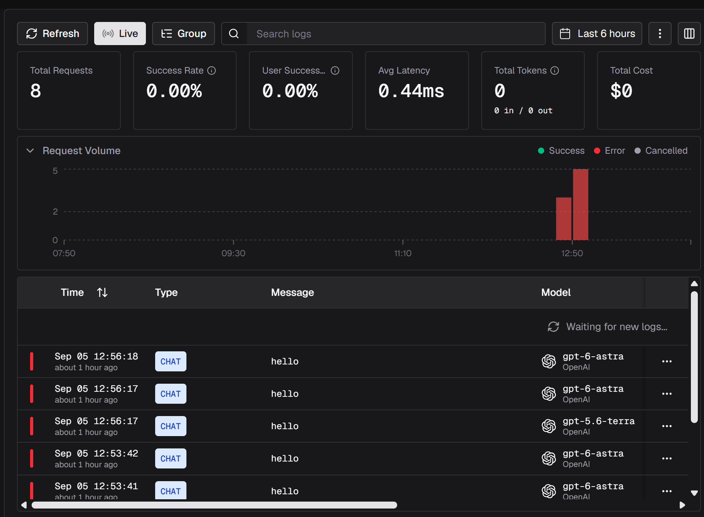
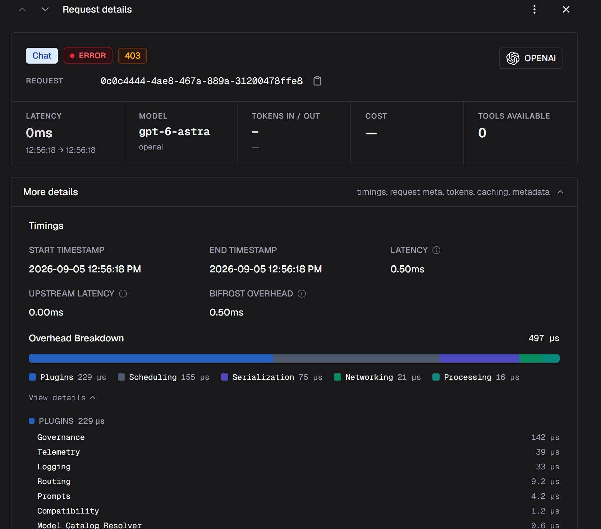
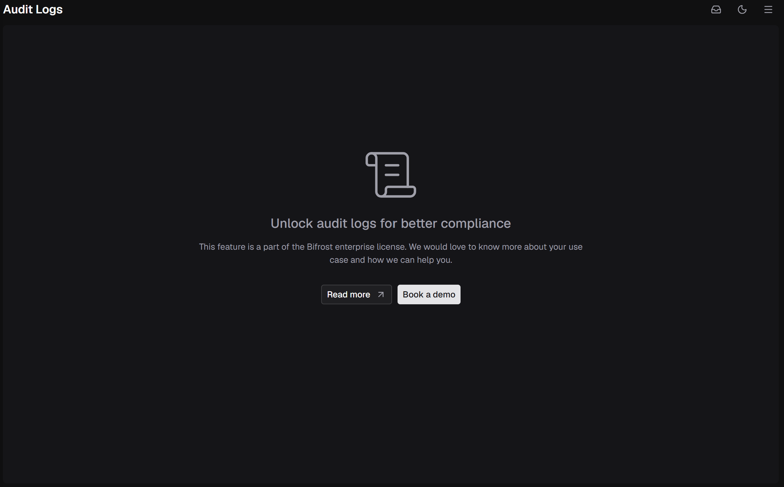

# Heimdall

A small, reproducible test of role-based access control at an AI gateway.

Heimdall stands up [Bifrost](https://github.com/maximhq/bifrost) locally, issues three virtual keys scoped to different models, then tries every key against every model and records what got through. Bifrost is the Norse rainbow bridge; Heimdall is the watchman who decides who crosses it. This repo is the watchman: the evidence base for [a dev.to article](https://dev.to/earlgreyhot1701d/gating-access-with-bifrost-nine-calls-three-refusals-one-trap-46h4) on whether an AI gateway's access controls actually hold. One operator, one setup, one honest report.

*The article is sponsored by the Bifrost team at Maxim AI. The test, the results, and the conclusions are mine.*

## What happened

Three roles, scoped narrowest to widest by function. Nine calls, each role against each model. Every claim below traces to a line in [`raw_output.log`](raw_output.log); the plain-English record is in [`RUN_REPORT.md`](RUN_REPORT.md).

| Role | routine | standard | restricted |
|---|---|---|---|
| interpreter | allowed | refused | refused |
| reporter | allowed | allowed | refused |
| clerk | allowed | allowed | allowed |

Six allowed, three refused, exactly as predicted before the run. The three refusals were HTTP 403 with this body, verbatim:

```json
{"type":"model_blocked","is_bifrost_error":false,"status_code":403,"error":{"message":"Model 'gpt-5.6-terra' is not allowed for this virtual key"},"extra_fields":{"routing_info":{},"provider":"openai","original_model_requested":"gpt-5.6-terra","resolved_model_used":"gpt-5.6-terra","request_type":"chat_completion"}}
```

Denials appear in the OSS observability view (Observability > LLM Logs, Status = Error): all eight refusals across the test runs, each with its reason, status, timestamp, and request ID. A refused call never reaches the provider (0 ms upstream, no tokens, no cost). Full detail in [`RUN_REPORT.md`](RUN_REPORT.md), Checkpoint 6.

## How I know it's real

This section is the point of the repo. A passing matrix proves nothing on its own; anything could print a table that agrees with itself. Three controls make the result checkable.

1. **Falsification test.** The same nine-call matrix was run three times. Between runs, one live setting was changed by hand and the script's expected table was left untouched. The one call whose access changed reported `403 -> 200 -> 403` across the three runs, and the run where reality diverged from the prediction reported a MISMATCH rather than hiding it. A harness that echoed its own expectations would have stayed silent. All three states are in the log. See [`RUN_REPORT.md`](RUN_REPORT.md), Checkpoint 4a.

2. **Negative control.** A call that succeeded was rerun with the Bifrost container stopped. It failed, verbatim:

   ```
   curl: (7) Failed to connect to localhost port 8090 after 0 ms: Could not connect to server
   ```

   Restarting the container restored the 200. So the traffic went through Bifrost, not around it. See [`RUN_REPORT.md`](RUN_REPORT.md), Checkpoint 4b.

3. **Credential asymmetry.** The client only ever held a Bifrost virtual key (`sk-bf-*`), which cannot authenticate to the provider. Allowed calls still returned real completions, so Bifrost substituted the real key upstream. Responses were stamped with `Server: fasthttp` and `X-Bifrost-*` headers a provider never sends, and denials used gateway-only language ("virtual key") the provider has no concept of.

## Rerun it yourself

```bash
git clone https://github.com/earlgreyhot1701D/heimdall
cd heimdall
cp .env.example .env      # add your own throwaway provider key
```

1. Start Bifrost: `docker run -p 8080:8080 maximhq/bifrost` (if port 8080 is taken, see Windows notes below).
2. Open `http://localhost:8080`. Add your provider key.
3. Create three virtual keys named `interpreter`, `reporter`, `clerk`. For each, set the **allowed-models access scope** (not just a budget) per the table in [`RUN_REPORT.md`](RUN_REPORT.md), Checkpoint 3. The access scope is what enforces the matrix; a budget does not restrict which models a key can reach.
4. Put the three `sk-bf-*` values in `.env`.
5. Prove your provider key reaches all three models directly, before Bifrost: `./scripts/00-preflight.sh`.
6. Run the matrix: `./scripts/02-matrix.sh`.

Use a throwaway provider key. This run cost $0.01 across 229 calls, and that included a 200-call loop later cut from scope; a clean run (the nine-call matrix plus the pre-flight) is a fraction of a cent. To bound spend on the provider side, use prepaid credits with auto-recharge turned off; OpenAI's monthly "budget" is a notification threshold, not a hard cutoff.

### Running on Windows

- **The scripts are bash. Run them in WSL or Git Bash, not PowerShell.** PowerShell can run individual `curl` calls but not the `.sh` files. In this run the scripts ran in WSL and WSL's `localhost` reached the container. If your WSL cannot reach the published port, use **Git Bash**, which shares the Windows network stack. No script changes either way.
- **The plain `curl` example fails in PowerShell.** PowerShell mangles the JSON quoting (escaped double quotes and single quotes both failed). Put the body in a file instead. Create `body.json` with `{"model":"openai/<model>","messages":[{"role":"user","content":"hello"}]}` and call:

  ```
  curl -X POST http://localhost:8080/v1/chat/completions -H "Content-Type: application/json" -d "@body.json"
  ```

- **Port 8080 may be occupied.** If `docker run -p 8080:8080 ...` fails with `bind: Only one usage of each socket address ... is normally permitted`, remap the host side: `docker run -p 8090:8080 maximhq/bifrost`, set `BIFROST_URL=http://localhost:8090` in `.env`, and use `localhost:8090` in the curl above. The scripts and the dry-run URL check both read `BIFROST_URL`, so they follow whatever port you pick. This run used 8090 for this reason.

## What I did not test

Stated plainly so the scope is clear.

- **Budget / spend-cap enforcement.** Attempted, not completed. A $0.05 cap was never approached because 200 one-word calls cost about $0.0016. The gap was test design, not the product; a real test needs enough spend to reach the cap.
- Rate limits (`token_max_limit`, `request_max_limit`).
- Teams and customers (department-level budgets above individual keys).
- SSO / OIDC identity providers.
- Multi-provider failover, and any second provider.
- Anything at real volume or under load.

## Findings

Brief here; full record in [`RUN_REPORT.md`](RUN_REPORT.md).

- **Access scoping and budgets are separate controls, and the one that reads like scoping is not.** A per-model budget caps spend; it does not restrict reach. The access scope defaults to open. Set only the budget and you have a key that looks restricted but is not.
- **The audit log is enterprise-gated in the OSS build.** The dedicated Audit Logs feature was not available; the test used Observability > LLM Logs instead, the record an OSS operator actually has.
- **Denied access is recorded, with its reason, and costs nothing.** Refusals show in LLM Logs under Status = Error, with the block reason, and never reach the provider.
- **The refused identity is captured, but not surfaced in the main view.** The virtual key is recorded under More details > Request Details, and in full in the one-click JSON export ([`evidence/denial-export-0c0c4444.json`](evidence/denial-export-0c0c4444.json): `virtual_key_name: "reporter"`, plus its UUID). The main entry row shows model, status, reason, timestamp, and request ID, but not who was refused. The record is complete and exportable; the criticism is placement.
- **The permission check is visible and timed.** The export's `overhead_breakdown` lists the governance check on its own line (`plugin.governance` at 141.562 microseconds), with 0 ms upstream on a denial.
- **The wider identity model was not exercised.** The export carries `user_id`, `team_id`, `customer_id`, and `business_unit_id`, all null here because only virtual keys were set up. Bifrost's identity model extends past what this run tested.

## Evidence

Machine-readable: [`evidence/denial-export-0c0c4444.json`](evidence/denial-export-0c0c4444.json) is the exported record of one denied request (its `virtual_key.value` is empty; the file contains no credentials).







## Links and sponsorship

- Bifrost: [github.com/maximhq/bifrost](https://github.com/maximhq/bifrost)
- Bifrost docs: [docs.getbifrost.ai/overview](https://docs.getbifrost.ai/overview)
- Article: [Gating Access with Bifrost: Nine Calls, Three Refusals, One Trap](https://dev.to/earlgreyhot1701d/gating-access-with-bifrost-nine-calls-three-refusals-one-trap-46h4)

This repo is the evidence base for a dev.to article sponsored by the Bifrost team at Maxim AI. The published post carries its sponsorship disclosure in its opening paragraphs. The author retained editorial control over conclusions, including limitations; the sponsor reviewed for factual accuracy and interlinking only.

---

AI Assisted. Human Approved. Powered by NLP.
